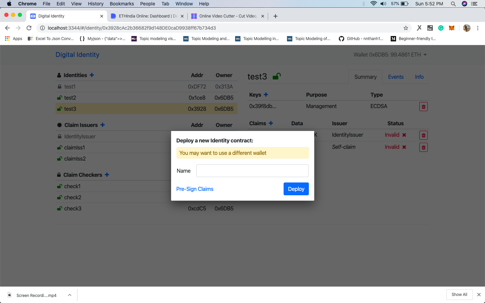
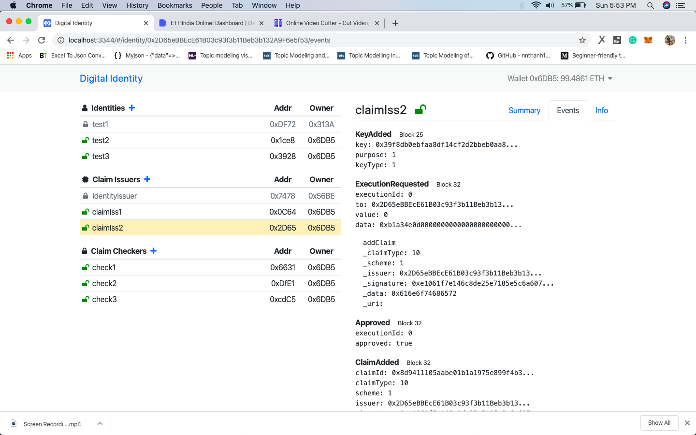
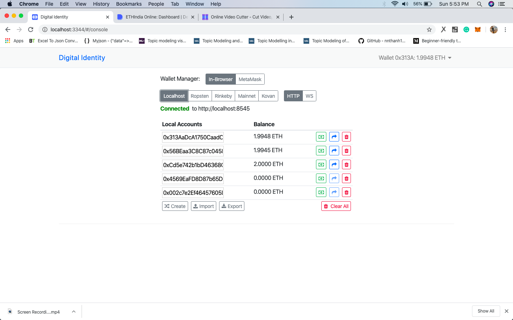
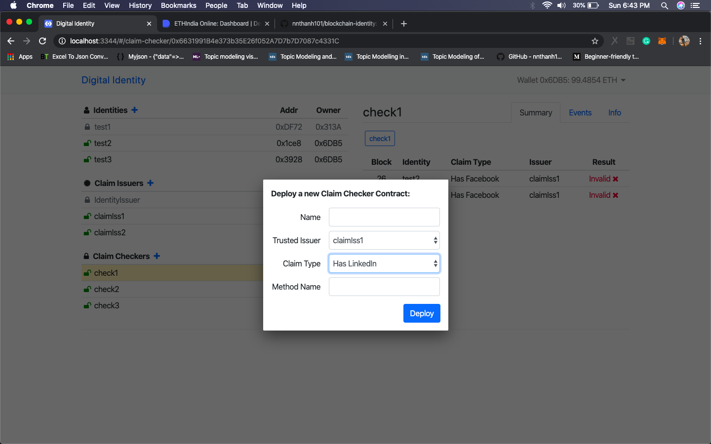
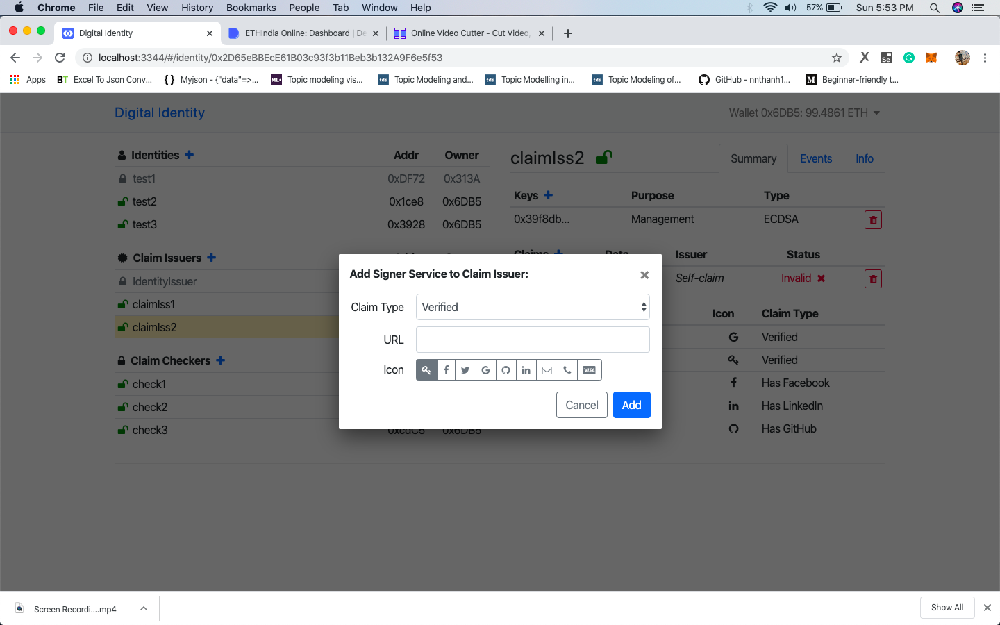

# Digital-Identity 

 **Digital Identity** on the **Blockchain**.

 a **Smart Contract** can protect function calls from being executed unless the **Sender** has a verified **Claim** from a trusted **Issuer**; e.g. build a mechanism into our Smart Contracts to only allow interactions from reputable people. ERC-725 allows for many more use-cases, such as multi-sig execution approvals and verification by contract call instead of key validation.

## Issuer Services

- [x] Certifiers provides Issuer-Services: 
  - [x] Has Phone
  - [x] Has Email
  - [x] [Has Facebook](https://developers.facebook.com/)
  - [x] [Has Linked-in](https://developer.linkedin.com/)
  - [x] [Has Google](https://console.cloud.google.com/apis/credentials)
  - [x] [Has Github](https://github.com/settings/developers)
  - [x] [Has Twitter](https://apps.twitter.com/) 


## Explanation

Imagine we want to deploy a Listing contract to sell a Airplane ticket, but only allow interactions from
users with a verified email address. How can we accomplish this with ERC 725?

First, lets define the entities that will be interacting:

* The _Consumer_ is an identity who wants to buy the ticket.
* The _Issuer_ is an identity which issues claims of type 'EMAIL_VERIFIED' & 'PHONE_VERIFIED'.
* The _Listing_ will only allow _Consumers_ with an _EMAIL_VERIFIED_ & _PHONE_VERIFIED_ claim from an _Issuer_ they trust.

This leaves us with a few questions...

1. How does the trusted Issuer verify an email address?
2. How does the Consumer get an EMAIL_VERIFIED & _PHONE_VERIFIED_ claim onto their Identity?
3. How can the Listing verify that the Consumer has an EMAIL_VERIFIED & _PHONE_VERIFIED_ claim from a trusted Issuer?

To answer these questions, lets go through the process of setting up all the required contracts and services, starting
with the Issuer.

The job of the Issuer is to act as a trusted third party. In the future, trusted organizations may deploy their own
Issuer identity contracts onto the blockchain, which third parties can then trust. Origin plan to offer their own basic
Issuer contracts for verifying email addresses, phone numbers, Facebook accounts, Twitter accounts, etc. Third parties
will then be able to trust that these Origin Issuer contracts only issue claims if they are, in fact, true.

How will an email verifier work? A typical verification service may involve an application, fThis application will have a standard interface for verifying an email
address, whereby a user is sent an email with a special code which they then submit back to the application. Now that
the email address has been verified, it can be signed with a private key known only to the email verifier app. The
corresponding public key is on the issuer's identity. This is how a claim is verified.

More explanation to follow...

## Walkthrough

1. 


 

2. 
 

3.

 

4.

 

5. 

 

6.
 


## Local Development

### Install NVM & Yarn
```              
  nvm install v9.11.1                                                                                &&
  curl -sS https://dl.yarnpkg.com/debian/pubkey.gpg     | sudo apt-key add -                         &&
  echo "deb https://dl.yarnpkg.com/debian/ stable main" | sudo tee /etc/apt/sources.list.d/yarn.list &&
  sudo apt-get update && sudo apt-get install yarn
```

### Installation 
```
  # 
  git clone https://github.com/affan00733/Identity-management-ETHIndia.git &&
  cd blockchain-identity                                      &&
  nvm use v9.11.1 && yarn install
```

### Run
```
  nvm use v9.11.1 &&
  yarn clean      &&
  yarn start
```

### Tests
```
  yarn test 
```